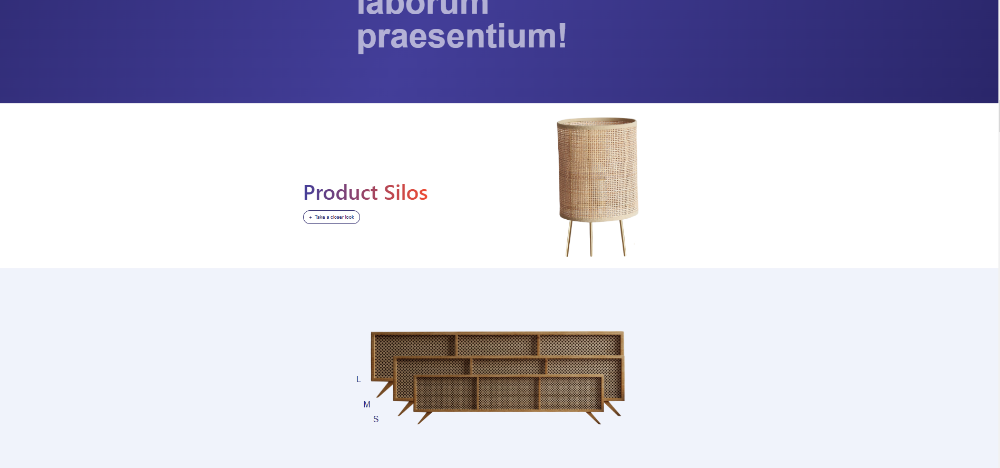
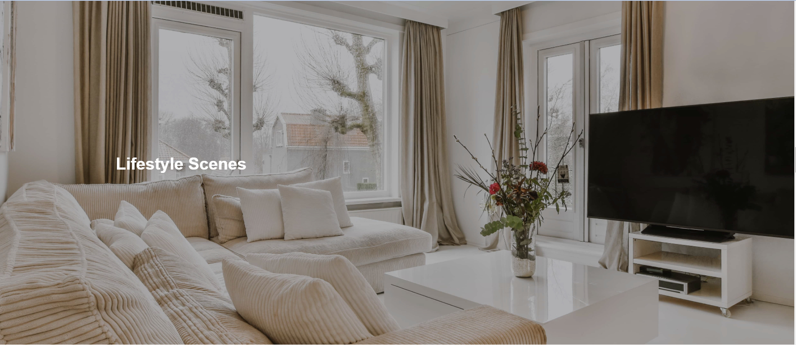
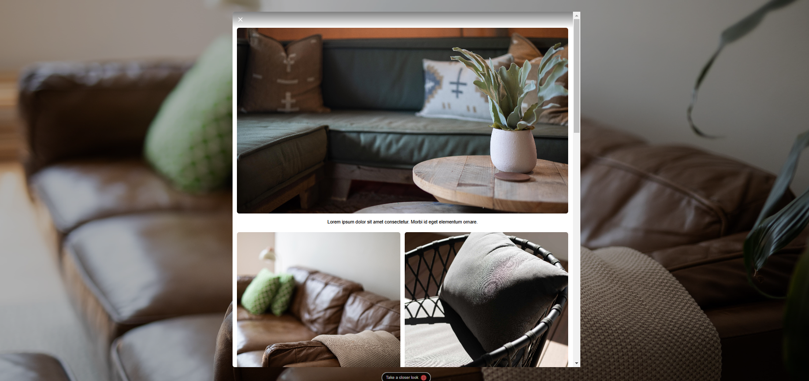
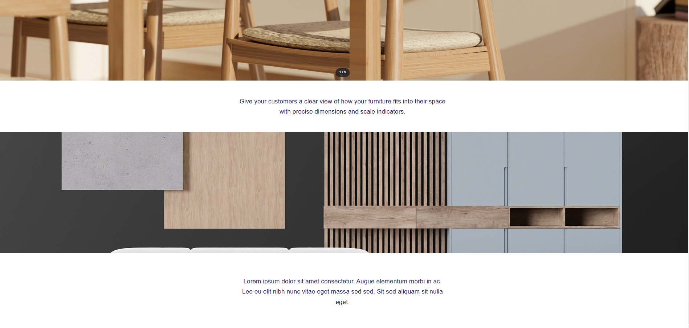

# Tulfa Furniture E-commerce

A modern, responsive e-commerce platform for furniture retail, built with React and enhanced with smooth animations.

## 📸 Preview

## 🌟 Features

- Interactive product catalog with detailed views
- Smooth animations and transitions using Framer Motion
- Responsive design optimized for all devices
- Modern UI with Tailwind CSS
- Dynamic product filtering and search
- Interactive product visualization

## 🚀 Tech Stack

- **React 18** - UI Library
- **Vite** - Build tool and development environment
- **Tailwind CSS** - Utility-first CSS framework
- **Framer Motion** - Animation library
- **Swiper** - Touch slider
- **Lucide React** - Icon system

## 🛠️ Quick Start

1. Clone the repository
2. Install dependencies: `npm install`
3. Start development server: `npm run dev`
4. Build for production: `npm run build`

## 📚 Documentation

For detailed information, please check the docs folder:

- [Project Structure](./docs/project-structure.md)
- [Architecture](./docs/architecture.md)
- [Installation Guide](./docs/installing-and-running.md)

## 🌐 Deployment
The project is deployed on 

Vercel: https://tulfa-gamma.vercel.app/

Netlify: https://tulfa.netlify.app/

